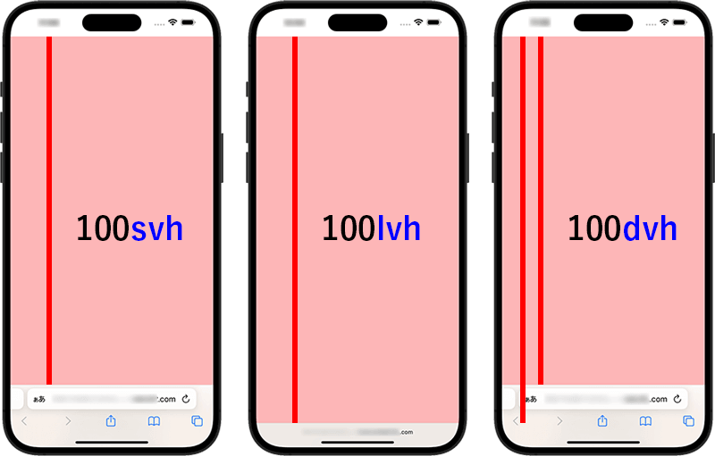

# Использование адаптивной верстки

## Цель:

Повторить медиа селекторы с изменением корневого размера шрифта и ширину контейнера

### Брейкпоинты

-   1024
-   768
-   480

_Отступ у контейнера на всех вьюпортах - `2rem`_

### Таблица процентов к REM

| px   | Проценты |
| ---- | -------- |
| 7px  | 43.75%      |
| 8px  | 50%      |
| 9px  | 56.25%   |
| 10px | 62.5%    |
| 11px | 68.75%   |
| 12px | 75%      |
| 13px | 81.25%   |
| 14px | 87.5%    |
| 15px | 93.75%   |
| 16px | 100%     |

_Обратите внимание, что в `body` значение текста перебивается на `1.6rem`, поэтому даже при `62.5%` значение является 16px_

_Это задание будет требовать от вас использование REM везде, кроме `@media` запросов и ширины контейнера_

https://github.com/user-attachments/assets/0bf9525f-801b-4e3e-b504-bbf34ec91822


## Теория: Что такое адаптивная верстка

**Адаптивная (респонсивная) верстка** — это подход, при котором интерфейс корректно отображается на любом устройстве и любом размере экрана: от смартфона до широкоформатного монитора.

Основные инструменты адаптивности:
- **Media queries** — CSS-правила, которые применяются только при определённых условиях (ширина экрана, ориентация и т.д.)
- **Относительные единицы** — `rem`, `em`, `%`, `vw`, `vh` вместо фиксированных `px`
- **Гибкие контейнеры** — `max-width`, `flex`, `grid` вместо жёстких размеров

---

## Теория: Media Queries

### Что это такое

`@media` — CSS-директива, которая позволяет применять стили только при выполнении определённого условия. Браузер читает их постоянно и переключает стили при изменении размера окна.

```css
@media тип_медиа and (условие) {
    /* стили применяются только если условие выполнено */
}
```

### Типы медиа

| Тип | Описание |
| --- | --- |
| `screen` | Экраны (мониторы, телефоны, планшеты) |
| `print` | Печать страницы |
| `all` | Все устройства (по умолчанию) |

На практике почти всегда используется `screen`.

### Условия (features)

```css
/* По ширине — самое частое */
@media screen and (max-width: 768px) { }   /* до 768px включительно */
@media screen and (min-width: 768px) { }   /* от 768px и выше */
@media screen and (min-width: 480px) and (max-width: 768px) { }  /* диапазон */

/* По ориентации */
@media screen and (orientation: portrait) { }   /* вертикальный экран */
@media screen and (orientation: landscape) { }  /* горизонтальный экран */

/* По плотности пикселей (ретина-экраны) */
@media screen and (min-resolution: 2dppx) { }
```

### Mobile First vs Desktop First

Это два противоположных подхода к написанию медиа-запросов:

#### Desktop First (используется в этом задании)
Сначала пишем стили для десктопа, затем перекрываем их для меньших экранов через `max-width`:

```css
/* Базовые стили — для десктопа */
.card {
    display: flex;
    flex-direction: row;
    font-size: 1.6rem;
}

/* Перекрываем для планшета */
@media screen and (max-width: 1024px) {
    .card { flex-direction: column; }
}

/* Перекрываем для телефона */
@media screen and (max-width: 480px) {
    .card { padding: 1rem; }
}
```

#### Mobile First
Сначала пишем стили для мобильного, затем расширяем для больших экранов через `min-width`:

```css
/* Базовые стили — для мобильного */
.card {
    display: flex;
    flex-direction: column;
}

/* Расширяем для планшета и выше */
@media screen and (min-width: 768px) {
    .card { flex-direction: row; }
}
```

> Mobile First считается более современным подходом, так как большинство трафика сегодня — мобильный. Но в рамках этого задания используется Desktop First.

### Порядок брейкпоинтов важен

При Desktop First медиа-запросы нужно писать **от большего к меньшему**, иначе они перекроют друг друга неправильно:

```css
/* ✅ Правильный порядок для Desktop First */
@media screen and (max-width: 1024px) { ... }
@media screen and (max-width: 768px) { ... }
@media screen and (max-width: 480px) { ... }

/* ❌ Неправильный порядок — 768px никогда не сработает */
@media screen and (max-width: 480px) { ... }
@media screen and (max-width: 1024px) { ... }  /* перекрывает предыдущий */
@media screen and (max-width: 768px) { ... }   /* никогда не сработает */
```

---

## Теория: REM и REM-хак

### Что такое REM

`rem` (root em) — единица измерения, равная размеру шрифта корневого элемента (`html`). В отличие от `em`, который относителен к родителю, `rem` всегда относителен к `html`.

```css
html { font-size: 16px; }  /* базовый размер браузера по умолчанию */

p { font-size: 1rem; }     /* = 16px */
h1 { font-size: 2rem; }    /* = 32px */
.box { padding: 1.5rem; }  /* = 24px */
```

### Проблема с px

Когда мы пишем размеры в пикселях, на каждом брейкпоинте приходится переопределять каждый элемент вручную:

```css
/* ❌ Всё в пикселях — на каждом брейкпоинте меняем каждый элемент */
h1 { font-size: 32px; margin-bottom: 24px; }
p { font-size: 16px; line-height: 24px; }
.card { padding: 24px; border-radius: 8px; }

@media screen and (max-width: 768px) {
    h1 { font-size: 28px; margin-bottom: 21px; }
    p { font-size: 14px; line-height: 21px; }
    .card { padding: 21px; border-radius: 7px; }
    /* и так далее для каждого элемента... */
}
```

### REM-хак: решение

Идея: если все размеры заданы в `rem`, то достаточно изменить `font-size` у `html` — и весь интерфейс масштабируется автоматически.

**Шаг 1.** Установить `font-size: 62.5%` на `html`:

```css
html {
    font-size: 62.5%;
    /* 16px * 0.625 = 10px */
    /* Теперь 1rem = 10px — удобно считать! */
}
```

**Шаг 2.** Вернуть нормальный размер текста в `body`:

```css
body {
    font-size: 1.6rem;
    /* 1.6 * 10px = 16px — стандартный размер */
}
```

**Шаг 3.** Писать все размеры в `rem`, считая по формуле `px / 10 = rem`:

```css
h1 { font-size: 3.2rem; }       /* 32px */
p { font-size: 1.6rem; }        /* 16px */
.card { padding: 2.4rem; }      /* 24px */
.gap { margin-bottom: 0.8rem; } /* 8px */
```

**Шаг 4.** На брейкпоинте — только одно правило в `@media`:

```css
@media screen and (max-width: 1024px) {
    html { font-size: 56.25%; }
    /* 16px * 0.5625 = 9px → 1rem = 9px */
    /* Весь интерфейс стал чуть меньше автоматически */
}

@media screen and (max-width: 768px) {
    html { font-size: 50%; }
    /* 16px * 0.5 = 8px → 1rem = 8px */
}

@media screen and (max-width: 480px) {
    html { font-size: 43.75%; }
    /* 16px * 0.4375 = 7px → 1rem = 7px */
}
```

Все элементы с `rem`-размерами уменьшатся пропорционально — без написания медиа-запросов для каждого элемента.

### Таблица процентов к REM

| px | % от 16px | 1rem = ? |
| -- | --------- | -------- |
| 7px | 43.75% | 7px |
| 8px | 50% | 8px |
| 9px | 56.25% | 9px |
| 10px | 62.5% | 10px |
| 11px | 68.75% | 11px |
| 12px | 75% | 12px |
| 13px | 81.25% | 13px |
| 14px | 87.5% | 14px |
| 15px | 93.75% | 15px |
| 16px | 100% | 16px |

> **Важно:** в `body` значение `font-size: 1.6rem` возвращает текст к 16px. Даже при `62.5%` на `html` (где 1rem = 10px), тело страницы отображает текст стандартного размера.

### Когда REM-хак неудобен

REM-хак отлично работает когда нужно пропорционально уменьшить интерфейс. Но есть случаи, когда это мешает:

- **Нужна разная логика на мобильном** — например, на телефоне карточки из горизонтальных становятся вертикальными. Масштабирование `font-size` здесь не поможет, придётся писать отдельные стили.
- **Pixel perfect на конкретных вьюпортах** — если дизайнер дал макет на 375px, где размеры не кратны базовому `rem`, придётся пересчитывать вручную.

В таких случаях можно:
- Поднять `font-size` обратно до `62.5%` в нужном брейкпоинте
- Писать отдельные медиа-правила для конкретных элементов

> В рамках нашей дисциплины допустим любой подход (кроме пикселей везде), так как мы придерживаемся доступности до тех пор, пока это не мешает повторению макета.

---

## Цель задания

Повторить медиа селекторы с изменением корневого размера шрифта и ширину контейнера.

### Брейкпоинты

- 1024px
- 768px
- 480px

_Отступ у контейнера на всех вьюпортах — `2rem`_

> **Важно:** `@media` запросы и ширина контейнера задаются в `px`. Всё остальное — в `rem`.

---

## Tips and Tricks

### «Масштабирование» интерфейса

#### ❌ Статичные px — много работы на каждом брейкпоинте

```css
span {
    font-size: 16px;
    margin: 16px 32px;
}

@media screen and (max-width: 768px) {
    span {
        font-size: 14px;
        margin: 14px 28px;
    }
}
```

#### ✔️ REM-хак — один `font-size` масштабирует всё

```css
html {
    font-size: 62.5%;
    /* 16 * 0.625 = 10px → 1rem = 10px */
}

body {
    font-size: 1.6rem;
    /* Возвращаем стандартный размер текста — 16px */
}

span {
    font-size: 1.6rem;  /* 16px */
    margin: 1.6rem 3.2rem;  /* 16px 32px */
}

@media screen and (max-width: 768px) {
    html {
        font-size: 56.25%;
        /* 16 * 0.5625 = 9px → 1rem = 9px */
        /* Весь интерфейс чуть уменьшился — автоматически */
    }
}
```

> **Осторожно:** REM-хак удобен, но иногда ломает логику дизайна. Если на мобильном нужно переписать интерфейс — либо пересчитывайте размеры вручную, либо поднимайте `font-size` обратно до `62.5%`.

### Логические свойства

#### ❌
`margin: 0 auto` — нелогическое свойство, всегда понимает «лево-право» относительно вьюпорта, а не элемента.

#### ✔️
`margin-inline: auto` — логическое свойство, применяет отступ относительно самого элемента.

### Overflow контейнера по вертикали

#### ❌
`height: 100vh` — если контента больше, чем на один экран, он будет обрезан.

#### ✔️
`max-height: 100vh` — если контента больше, контейнер расширится.

### Overflow контейнера по горизонтали

#### ❌
`width: 144rem` — при достижении этой ширины придётся писать отдельный медиа-запрос на `width: 100%`.

#### ✔️
`max-width: 144rem` — при достижении ширины контейнер автоматически займёт всю ширину родителя.

### Двойственность viewport единиц измерения на мобильных устройствах

Наличие "авто скрываемой" навигации в браузере заставляет обычные vh единицы измерения работать по-разному в разных браузерах



`dvh` не является решением всех проблем, так как при скролле меню скроется, а высота контейнера вырастет - элементы будут прыгать

_Поэтому чаще всего приходится решать в зависимости от ситуации и ТЗ_

# Как сдавать

- Создайте форк репозитория в вашей организации с названием-этого-репозитория-вашафамилия
- Используя ветку wip сделайте задание
- Зафиксируйте изменения в вашем репозитории
- Когда документ будет готов - создайте пул реквест из ветки wip (вашей) на ветку main (тоже вашу) и укажите меня (ktkv419) как reviewer

Не мержите сами коммит, это сделаю я после проверки задания
